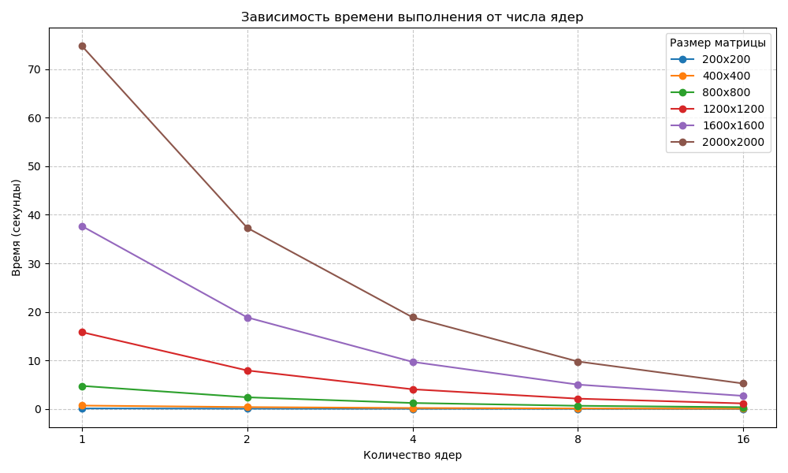

# Лабораторная работа №5: Анализ производительности параллельных вычислений на СК «Сергей Королёв»

## Цель работы
Изучение характеристик масштабируемости параллельного алгоритма перемножения матриц на суперкомпьютере. Оценка показателей ускорения и эффективности использования вычислительных ресурсов.

## Исходные данные
* **Суперкомпьютер:** «Сергей Королёв»
* **Технология:** MPI
* **Компилятор:** mpixx
* **Количество ядер:** От 1 до 16 ядер

## Методика тестирования
Для каждого размера матрицы ($200 \times 200$ — $2000 \times 2000$) были выполнены замеры времени на разном количестве ядер. Данные усреднялись и сохранялись в файлы `.out` в соответствующие директории (`results/{n} cores/`).

## Таблица результатов

|   Size | 1 Core(ms)| 2 Cores(ms) | 4 Cores(ms) | 8 Cores(ms) | 16 Cores(ms) |
|-------:|----------:|------------:|------------:|------------:|-------------:|
|    200 |  0.102247 |  0.0579181  |  0.031049   |  0.0174429  |  0.0056655   |
|    400 |  0.693913 |  0.380989   |  0.191813   |  0.0976379  |  0.0511999   |
|    800 |  4.74628  |  2.40048    |  1.22779    |  0.649391   |  0.359658    |
|   1200 |  15.8151  |  7.92734    |  4.05323    |  2.11968    |  1.13945     |
|   1600 |  37.6667  |  18.8541    |  9.69782    |  5.01701    |  2.69439     |
|   2000 |  74.767   |  37.3076    |  18.8814    |  9.77781    |  5.2447      |

## График результатов 

## Выводы
В ходе лабораторной работы был выполнен анализ производительности параллельных вычислений на СК "Сергей Королёв" с использованием программы, написанной по технологии MPI. Эффективность параллельной программы напрямую зависит от объема входных данных. Чем выше размерность матриц, тем ближе показатели ускорения к идеальным (линейным), так как время на выполнение арифметических операций начинает существенно преобладать над временными затратами на пересылку данных между узлами суперкомпьютера.