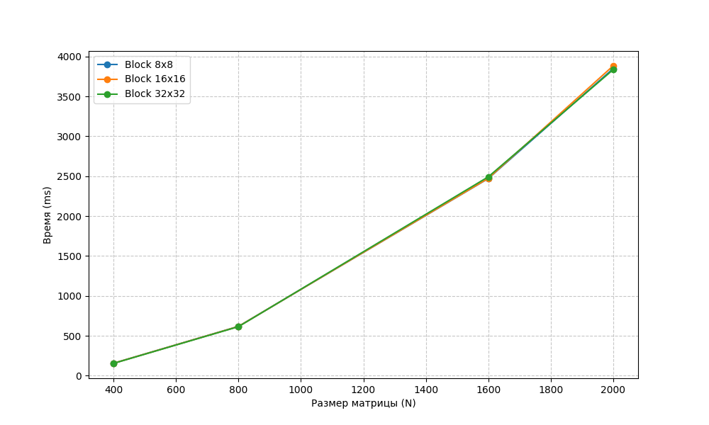

# Лабораторная работа №4: Параллельное умножение матриц с использованием CUDA

**Цель**: Модификация программы для параллельной работы по технологии CUDA и анализ влияния конфигурации сетки блоков на производительность.

## Исходные данные
- Процессор: Intel Core i5 7400 3.3GHz
- Видеокарта: NVIDIA GTX 1050Ti 4 GB
- Оперативная память: 16 GB DDR4 2400MHz
- ОС: Ubuntu 26.04 LTS

## Ход работы
В ходе лабораторной работы алгоритм перемножения матриц был адаптирован для выполнения на графическом процессоре с использованием архитектуры CUDA. Для автоматизации тестирования использовался модуль tools.py, обеспечивающий запуск скомпилированного модуля lab4 с передачей путей к закэшированным данным в директории matrix_data в качестве аргументов командной строки.

Основной расчет производился на GPU, при этом замерялось полное время выполнения (Full Execution Time), включающее выделение памяти на устройстве (cudaMalloc), пересылку данных между оперативной памятью и видеопамятью (cudaMemcpy) и работу вычислительного ядра. Эксперименты проводились для различных размеров матриц (от 400x400 до 2000x2000) и трех конфигураций сетки блоков: 8x8, 16x16 и 32x32.

Для визуализации результатов был сгенерирован файл lab4_plots.png, демонстрирующий зависимость времени выполнения от размера матрицы при различных размерах блока потоков.

## Таблица результатов
| Размер матрицы (N) | Блок 8x8 (ms) | Блок 16x16 (ms) | Блок 32x32 (ms) |
| --- | --- | --- | --- |
| **400** | 156.95 | 156.51 | 155.07 |
| **800** | 618.74 | 617.89 | 615.31 |
| **1600** | 2471.10 | 2473.73 | 2492.42 |
| **2000** | 3848.24 | 3882.99 | 3835.08 |

## Графики
       

## Вывод
В ходе лабораторной работы была реализована параллельная версия алгоритма умножения матриц на языке C++ с применением технологии CUDA. Анализ результатов показал, что при включении в замер времени операций обмена данными между CPU и GPU, основная часть временных затрат приходится на пересылку данных по шине PCI-Express, в то время как время работы самого ядра остается стабильно низким. Изменение конфигурации сетки блоков (8x8, 16x16, 32x32) при этом не оказывает существенного влияния на итоговое время выполнения при данных размерностях, так как пропускная способность памяти является основным ограничивающим фактором производительности.