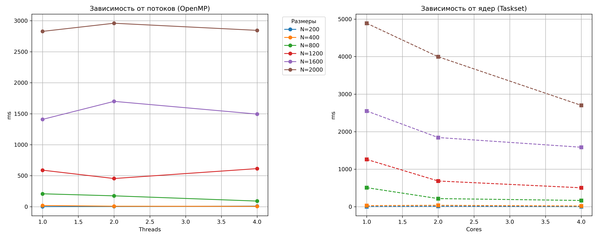

# Лабораторная работа №2: Параллельное умножение матриц (OpenMP)

**Цель**: Оценка эффективности распараллеливания алгоритма и исследование зависимости производительности от количества потоков и используемых ядер.

## Исходные данные
- Процессор: Intel Core i5 7400 3.3GHz (4 ядра, 4 потока)
- Видеокарта: NVIDIA GTX 1050Ti 4 GB
- Оперативная память: 16 GB DDR4 2400MHz
- ОС: Ubuntu 26.04 LTS

## Ход работы
В ходе лабораторной работы была реализована параллельная версия алгоритма умножения матриц с использованием технологии OpenMP. 

С помощью обновленного модуля tools.py была проведена серия из двух экспериментов:

- **Исследование потоков**: Запуск программы с варьированием количества потоков OpenMP (1, 2, 4) при доступности всех аппаратных ресурсов.

- **Исследование ядер**: Ограничение доступных физических ядер процессора при фиксированном количестве потоков.

Подготовка данных и верификация (сравнение с NumPy) осуществлялись автоматически. Результаты замеров зафиксированы в миллисекундах. По итогам экспериментов был сгенерирован файл lab2_plots.png, визуализирующий полученные зависимости.

## Таблицы результатов
### Таблица для потоков
| N / Потоки | Время для 1 потока(ms) | Время для 2 потоков(ms) | Время для 4 потоков(ms)
| --- | --- | --- | --- |
| **200** | 1.61 | 3.91 | 10.05 |
| **400** | 19.58 | 8.15 | 6.25 |
| **800** | 208.50 | 175.57 | 91.05 |
| **1200** | 589.52 | 454.85 | 614.66 |
| **1600** | 1408.52 | 1699.45 | 1493.99 |
| **2000** | 2828.46 | 2959.56 | 2844.71 |

### Таблица для ядер
| N / Ядра | Время для 1 ядра(ms) | Время для 2 ядер(ms) | Время для 4 ядер(ms) |
| --- | --- | --- | --- | 
| **200** | 4.31 | 12.35 | 2.89 |
| **400** | 29.93 | 37.62 | 19.77 |
| **800** | 508.16 | 216.74 | 166.90 |
| **1200** | 1261.32 | 685.60 | 504.76 |
| **1600** | 2551.45 | 1843.75 | 1585.17 |
| **2000** | 4889.17 | 3996.07 | 2701.13 |

## Графики
       

## Вывод
В ходе работы была реализована параллельная версия умножения матриц на C++ с использованием OpenMP. На малых матрицах ($N < 800$) программа работает медленнее, так как время на создание потоков превышает время самих вычислений. На больших размерах ($N \ge 800$) скорость упирается в пропускную способность оперативной памяти. Так как матрицы не помещаются в кэш-память процессора, ядра простаивают в ожидании данных из RAM, что мешает получить кратное ускорение.  Оптимальное количество потоков по итогам работы алгоритма — 4 (по числу ядер).