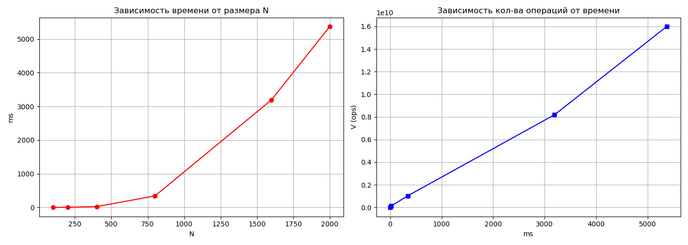

# Лабораторная работа №1: Последовательное умножение матриц

**Цель:** Реализация базового алгоритма и замер производительности на одном ядре.

## Исходные данные
- Процессор: Intel Core i5 7400 3.3GHz
- Видеокарта: NVIDIA GTX1050Ti 4 GB
- Оперативная память: 16 GB DDR4 2400MHz
- ОС: Ubuntu 26.04 LTS

## Ход работы
В ходе лабораторной работы c помощью модуля tools.py реализована автоматическая генерация квадратных матриц размерностью $N \times N$. Данные кэшируются в директории matrix_data под именами A_{N}.txt и B_{N}.txt. Для работы основной программы используется механизм символьных ссылок (A.txt, B.txt). Основной расчет производился скомпилированным модулем lab1. Результат перемножения сохранялся в файл C.txt. Для анализа производительности были проведены замеры времени на выборке размеров от 100x100 до 2000x2000. В ходе тестов фиксировалось время выполнения в миллисекундах и рассчитывалось общее количество арифметических операций по формуле $V = 2 \cdot N^3$.

Для визуализации результатов был сгенерирован файл lab1_plots.png, содержащий два графика:
- **Время от размера N**: Демострирует степенной рост времени, что соответствует теоретической сложности $O(N^3)$.
- **Операции от времени**: Показывает линейную зависимость между объемом вычислений и затраченным временем

## Таблица результатов
| Размер матриц | Время, мс | Кол-во операций |
| :--- | :--- | :--- |
| 100           | 0.33      | 2 000 000       |
| 200           | 3.68      | 16 000 000      |
| 400           | 29.65     | 128 000 000     |
| 800           | 282.70    | 1.02e+09        |
| 1600          | 3315.24   | 8.19e+09        |
| 2000          | 6571.40   | 1.60e+10        |

## Графики
       

## Вывод
В ходе лабораторной работы была успешно реализована последовательная версия алгоритма умножения квадратных матриц на языке C++ и экспериментально подтверждена теоретическая временная сложность $O(N^3)$: при увеличении размера матрицы в 2 раза время выполнения возрастает примерно в 8 раз, а автоматизированная верификация с помощью библиотеки NumPy подтвердила полную корректность работы алгоритма на всех тестовых выборках (от 100 до 2000).