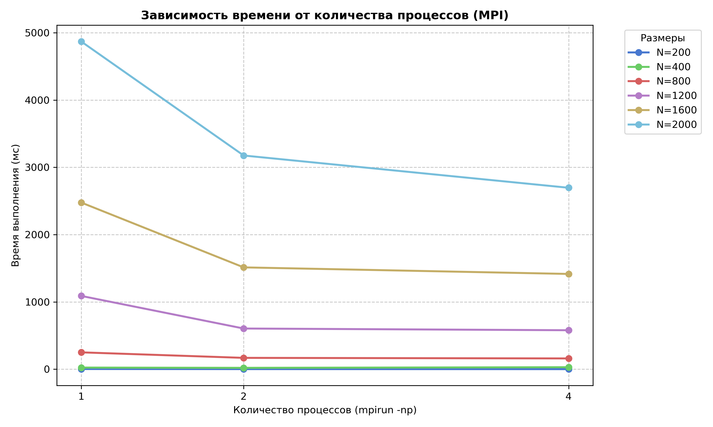

# Лабораторная работа №3: Распределенное умножение матриц (MPI)

**Цель**: Модификация программы умножения матриц для работы в кластерной архитектуре с распределенной памятью с использованием стандарта MPI.

## Исходные данные
- Процессор: Intel Core i5 7400 3.3GHz (4 ядра, 4 потока)
- Видеокарта: NVIDIA GTX 1050Ti 4 GB
- Оперативная память: 16 GB DDR4 2400MHz
- ОС: Ubuntu 26.04 LTS

## Ход работы
Алгоритм перемножения матриц $C = A \times B$ был адаптирован под технологию MPI. В отличие от OpenMP, где потоки обращаются к общей памяти, в данной реализации:
1. Главный процесс (rank 0) считывает исходные данные.
2. Матрица $B$ рассылается всем узлам с помощью функции `MPI_Bcast`.
3. Матрица $A$ разрезается на равные горизонтальные полосы и раздается узлам с помощью `MPI_Scatter`.
4. Каждый процесс вычисляет свою локальную часть итоговой матрицы $C$.
5. Функция `MPI_Gather` собирает и склеивает результаты на нулевом процессе.

## Таблицы результатов

| N / Ядра | Время для 1 ядра | Время для 2 ядер | Время для 4 ядер |
| --- | --- | --- | --- | 
| **200** | 3.01 | 1.65 | 1.06 |
| **400** | 24.32 | 20.37 | 29.84 |
| **800** | 250.57 | 168.70 | 160.18 |
| **1200** | 1089.03 | 604.73 | 579.24 |
| **1600** | 2476.43 | 1513.21 | 1415.70 |
| **2000** | 4869.09 | 3175.45 | 2696.26 |

## Графики
       

## Вывод
В ходе работы была реализована параллельная версия умножения матриц с использованием технологии MPI. Программа была модифицирована для работы в распределенной памяти: применены коллективные операции MPI_Bcast, MPI_Scatter и MPI_Gather, а автоматическая верификация подтвердила правильность вычислений на всех размерах матриц (от 200 до 2000).